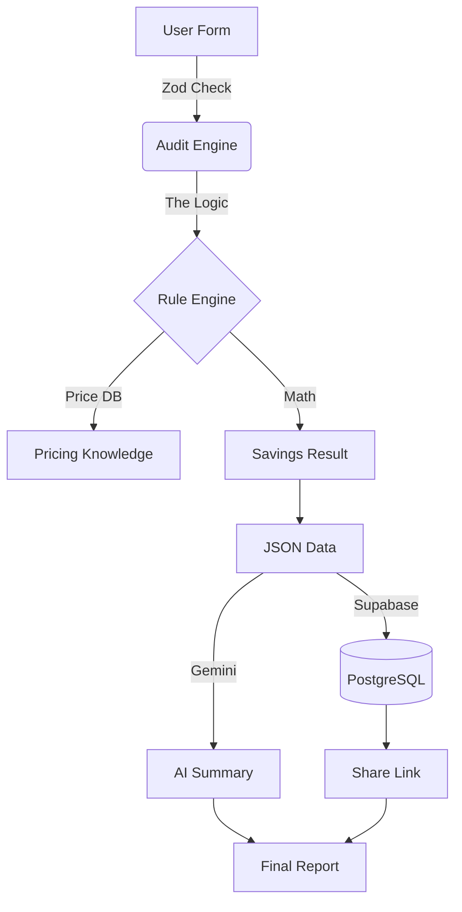

# How Fluxora actually works (The Architecture)

## 🛠️ The Tech Choices
I went with a pretty standard but "modern" stack to move fast:
1. **Next.js 15:** Use it mostly for **Server Actions**. I don't want any of the audit math or DB keys to ever touch the browser. It’s safer and faster.
2. **TypeScript:** Since I'm doing financial math, I need types. I don't want `undefined` bugs when telling a CEO they're wasting $10k.
3. **Tailwind CSS:** No templates here. Hand-coded everything to get that "CFO Blueprint" look. It’s much lighter and easier to customize.

## 🏗️ High-Level Flow

## 🛡️ Why Zod? (The "Bouncer" Strategy)
I use **Zod** as a "Bouncer" at the front door. 
- **Fail-Fast:** If a user types "abc" in a dollar field, Zod kills it before it ever hits my math engine.
- **Auto-Types:** It generates my TS types automatically so the data is always clean.
- **Good Errors:** It lets me show "Please enter a valid number" instantly without a round-trip.

## 🏗️ The Audit Pipeline: Step-by-Step
1. **Ingestion:** User hits the form. Zod cleans it. We capture seats for subscriptions and monthly token estimates (in thousands) for API-based tools.
2. **The Logic:** The **Audit Engine** (my "Brain") checks for **Redundancy**. Like if you have 3 different LLM tools, it flags them.
3. **Math:** We compare your spend against 2026 retail prices in our `knowledge.ts` file. 
4. **Persistence:** We save everything to **Postgres (via Prisma)** and generate a unique `nanoid` slug for the public link.
5. **AI summary:** We send the raw math to **Gemini**. It writes the "human" part of the report so the CFO actually understands the rationale.

## 🚀 Scaling to 10k audits a day?
If this thing goes viral, I'd have to change a few things:
- **Redis:** I'd add a cache layer so I'm not hitting Postgres for every single public link view.
- **Edge Runtimes:** Move the logic to the Edge to lower latency for users in different regions.
- **Direct Auth:** Instead of manual input, I'd eventually need a **Plaid** or **Mercury** integration to just "read" the spend automatically.
