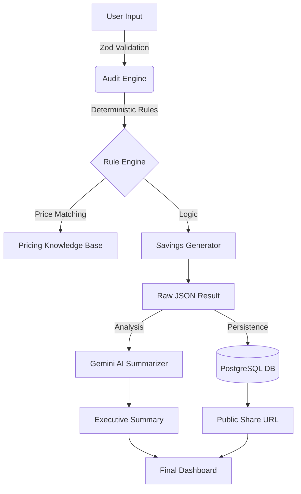

## 🛠️ Technical Choices & Justification

To satisfy the core project constraints, we have made the following foundational choices:

1. **Framework: Next.js 15 (React 19)**: Chosen for its **Server Actions** capability, which allows us to perform secure, server-side database operations (Prisma) and API calls (Gemini/Resend) without exposing sensitive logic or secrets to the client.
2. **Language: TypeScript**: Non-negotiable for a financial tool. TypeScript ensures that the **Deterministic Audit Engine** operates on strictly typed data, eliminating runtime errors in savings calculations.
3. **UI: Hand-Coded Tailwind**: We avoided all website builders. The interface is built with raw **Tailwind CSS** and **Radix UI** primitives to ensure maximum performance and a unique, premium aesthetic that cannot be achieved with templates.

## 🏗️ High-Level System Overview

## 🛡️ Architectural Decision: Why Zod? (vs. SQL)

A common question is: *"Why use Zod for validation instead of just relying on SQL constraints?"* 

We use **Zod** as the primary validation layer for four critical reasons:
1. **Early Failure (Fail-Fast)**: Zod catches "dirty" input (e.g., text in a number field) at the application boundary. If we waited for SQL, we would have already executed complex JavaScript math on invalid data, leading to `NaN` errors or server crashes.
2. **Type Safety**: Zod automatically generates TypeScript types. This ensures that the **Audit Engine** receives data that is 100% compliant with our expected schemas, reducing "undefined" bugs.
3. **Complex Logic**: SQL is great for checking types, but Zod is better for business logic validation (e.g., "The seat count must be greater than 1 if the plan is 'Enterprise'").
4. **User Experience**: Zod allows us to return human-readable error messages to the frontend instantly without waiting for a database round-trip.

## 🏗️ The Fluxora Pipeline: Step-by-Step

Here is the exact journey of a single audit:

#### 1. Ingestion & Validation
The user interacts with `AuditForm.tsx`. As soon as they hit "Generate Audit," the form data is sent to a **Next.js Server Action** where **Zod** intercepts it for sanitization and type enforcement.

#### 2. Audit Logic & Redundancy Detection
The **Audit Engine** orchestrates the analysis. It queries the **Pricing Knowledge Base** (`core/audit-engine/knowledge.ts`) for May 2026 retail values. It then performs a **Category-Based Redundancy Sweep** (e.g., checking for overlapping "Code" or "Chat" tools) to identify cases where a user is paying twice for the same LLM capability.

#### 3. Savings Calculation
The **Savings Generator** compares current spend against optimized recommendations.
*   **Logic**: `(Current Monthly Spend) - (Optimized Monthly Spend) = Monthly Savings`.
*   It produces a detailed JSON object containing flags for setiap tool (e.g., "Overlap found between Claude and ChatGPT").

#### 4. Cloud Persistence (Prisma 6)
We save the audit result to **Supabase PostgreSQL** using a stable Prisma 6 architecture.
*   **Unique Slug**: `nanoid` generates a URL-safe ID (e.g., `TDUtudVR4i`).
*   **Benefit**: This creates a permanent, publicly shareable link that loads instantly for anyone, anywhere.

#### 5. AI Executive Summary
The raw audit data is sent to **Gemini 1.5 Flash**. 
*   **Role**: Gemini acts as a "Virtual CFO," translating raw math into a 2-paragraph executive memo that explains the strategic rationale for the savings.

#### 6. Final Dashboard & Benchmarking
The `ResultsClient.tsx` renders the final experience:
*   **Visuals**: Charts, Redundancy Alerts, and Actionable Steps.
*   **Benchmarking**: A Stage-Based system (Seed, Series A, etc.) compares the user's spend-per-employee against industry peers, providing a percentile rank and "CFO-Grade" status.
*   **Conversion**: A lead capture form connects the user's identity to the specific audit record for follow-up capital recovery in the Fluxora Marketplace.

---

### 📊 Summary Table

| Step | Component | Input | Output |
| :--- | :--- | :--- | :--- |
| **Ingestion** | `AuditForm` | User Clicks | Form Data |
| **Sanitization** | **Zod** | Form Data | Validated JSON |
| **Analysis** | **Audit Engine** | Validated JSON | Savings Logic |
| **Intelligence** | **Gemini AI** | Raw Math | Executive Memo |
| **Storage** | **PostgreSQL** | Audit Results | Shared Link (Slug) |
| **Delivery** | **Dashboard** | Slug | Visual UI |

**This pipeline ensures that Fluxora is both Mathematically Precise (Deterministic) and Human-Friendly (AI Summaries).**

## 🚀 Future Scalability

If we scale to 100k+ concurrent audits, our roadmap includes:
1. **Redis Caching**: To prevent hitting the Postgres database for every public URL view.
2. **Edge Runtimes**: Moving the audit engine to the Edge to minimize latency.
3. **Plaid Integration**: Automating the "Ingestion" step by reading real transaction data from bank feeds.
