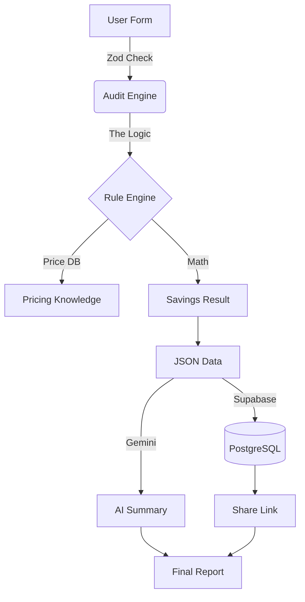
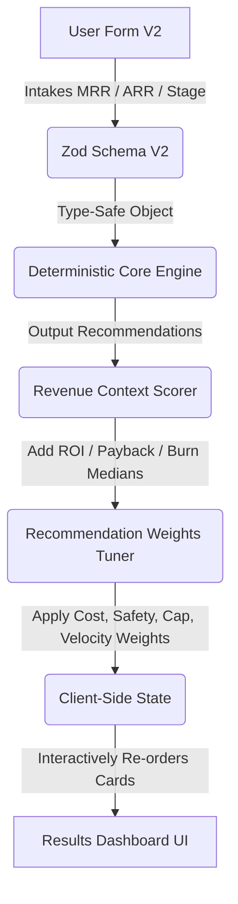

# How Fluxora actually works (The Architecture)

## 🛠️ The Tech Choices
I went with a pretty standard but "modern" stack to move fast:
1. **Next.js 15:** Use it mostly for **Server Actions**. I don't want any of the audit math or DB keys to ever touch the browser. It’s safer and faster.
2. **TypeScript:** Since I'm doing financial math, I need types. I don't want `undefined` bugs when telling a CEO they're wasting $10k.
3. **Tailwind CSS:** No templates here. Hand-coded everything to get that "CFO Blueprint" look. It’s much lighter and easier to customize.

## 🏗️ High-Level Flow

*Visual representation of the data lifecycle from ingestion to executive summary.*

### 🛠️ Core Components

*Detailed breakdown of the deterministic engine and persistence layer.*

## 🛡️ Why Zod? (The "Bouncer" Strategy)
I use **Zod** as a "Bouncer" at the front door. 
- **Fail-Fast:** If a user types "abc" in a dollar field, Zod kills it before it ever hits my math engine.
- **Auto-Types:** It generates my TS types automatically so the data is always clean.
- **Good Errors:** It lets me show "Please enter a valid number" instantly without a round-trip.

## 🔍 Deep Dive: The Fluxora Pipeline Logic

### 1. The "Bouncer" (Ingestion & Zod Validation)
Before any math happens, the data must be bulletproof.
- **Behind the Hood:** We use a strict Zod schema (`AuditFormSchema`) that enforces type-safety on the server. If a user tries to inject malicious strings or invalid numbers, the Server Action rejects it immediately.
- **Why:** This prevents "garbage-in, garbage-out" scenarios where bad input could lead to hallucinated savings.

### 2. The "Brain" (Deterministic Audit Engine)
This is where the actual intelligence lies. Unlike other "AI" tools that use LLMs for math, we use a **Deterministic Rule Engine**.
- **The Logic:** We iterate through your tool stack and apply weighted rules:
    - **Redundancy Rule:** If "Cursor" is detected, it automatically marks "GitHub Copilot" and "ChatGPT Coding" as `CONSOLIDATE`.
    - **Legacy Replacement Rule:** It flags legacy wrappers (Jasper/Copy.ai) and recommends a direct switch to Claude Pro for a 60% immediate saving.
    - **API Gateway Trigger:** If a team has 10+ seats on a consumer plan, it triggers a recommendation for an API Gateway (TypingMind) to reclaim "lost" seat costs.
- **The Knowledge Base:** All calculations are benchmarked against `knowledge.ts`, a registry of verified May 2026 pricing.

### 3. The "Orchestrator" (Gemini AI Summary)
Once the math is finished, we have a raw JSON of savings. CFOs don't read JSON; they read memos.
- **Behind the Hood:** We feed the **raw math results** (not the user's raw input) into Google Gemini. 
- **The Prompting:** We use a highly specific "Executive Persona" prompt that instructs Gemini to write a 3-sentence financial justification for the found savings. It focuses on "Capital Recovery" and "Operational Efficiency."

### 4. The "Vault" (Prisma + Supabase)
To make reports shareable, they must live in the cloud.
- **Logic:** We generate a unique `nanoid` (a shorter, more URL-friendly ID than a UUID). 
- **Persistence:** We save the audit results, the company metadata, and the AI summary in a single atomic transaction. 
- **Shareability:** When someone visits `/results/[slug]`, we perform an optimized lookup. If the database is down, the app gracefully falls back to `sessionStorage` for the local user so they never see a broken page.

### 5. The "Presenter" (Results UI & PDF)
The final step is the high-fidelity dashboard.
- **Logic:** We use `recharts` for the 3D-effect bars and `framer-motion` for the staggered load animations.
- **Print Mode:** We've implemented a specialized `@media print` CSS layer. When you click "Download PDF," the browser uses our custom print stylesheet to format the web dashboard into a clean, single-page executive memo.

## 🚀 Scaling to 10k audits a day?
If this thing goes viral, I'd have to change a few things:
- **Redis:** I'd add a cache layer so I'm not hitting Postgres for every single public link view.
- **Edge Runtimes:** Move the logic to the Edge to lower latency for users in different regions.
- **Direct Auth:** Instead of manual input, I'd eventually need a **Plaid** or **Mercury** integration to just "read" the spend automatically.

---

## 📈 Fluxora v2: The CFO Revenue Mapping & Tuning Layer

In our **v2 Release (May 17, 2026)**, we introduced three advanced architectural modules designed to elevate the audit from a diagnostic list of recommendations to an interactive, CFO-grade boardroom asset.

### 1. Zod Schema V2 Layer (`schemas/audit-v2.ts`)
* **Strategy:** Additive composition. We leverage Zod’s `.extend()` syntax to build `AuditFormSchemaV2` from the original `AuditFormSchema`.
* **Details:** This layers on a `revenueContext` object (MRR, ARR, growth rates, runway) and a `fundingStage` enum (`PRE_SEED`, `SEED`, `SERIES_A`, `SERIES_B`, `LATE_STAGE`) as optional inputs, preserving 100% backward-compatibility for basic audits.

### 2. CFO Revenue Context & ROI Core (`core/revenue-context/index.ts`)
* **Calculations:** Takes raw dollar savings and converts them into metrics that resonate with startup investors:
  * **AI Spend as % of MRR:** Total monthly spend vs. Monthly Recurring Revenue.
  * **Annualized ARR Savings:** Scaled yearly recovery potential against ARR.
  * **Stage-based Peer Benchmarking:** Pulls real-time peer medians mapped from SaaS spending databases:
    * *Pre-Seed:* 12.0% of MRR
    * *Seed:* 8.5% of MRR
    * *Series A:* 5.0% of MRR
    * *Series B:* 3.2% of MRR
    * *Late Stage:* 1.8% of MRR
  * **Individual Payback Periods:** Calculates the time (in months) required to recover setup/resettling friction costs for proposed tool switches.

### 3. Interactive Weights Tuner (`core/recommendation-weights/index.ts`)
* **Philosophy:** Dynamic client-side agency. We avoid server-side round trips and database rewrites to maintain zero-latency re-ranking.
* **Algorithm:** Assigns a composite score ($0.0 - 10.0$) to each recommendation based on four weighted vectors:
  1. **Cost Savings:** Scaled dollar amounts against the maximum savings found in the audit.
  2. **Migration Safety:** Action-type heuristics (e.g. `KEEP` = 10, downgrade/rightsize = 7, direct replacement `REPLACE` = 3).
  3. **Capability Gain:** Flags upgrade value (e.g. switching to premium ecosystems like Claude/Cursor = 10).
  4. **Team Velocity:** Evaluates tooling friction and team retraining time.
* **Component:** `WeightsTuner` houses pre-calculated preset chips ("Runway is Critical", "Don't Break My Team", "Upgrade Stack") and live-syncs slider values to the `displayedRecs` state hook in `ResultsClient`.
