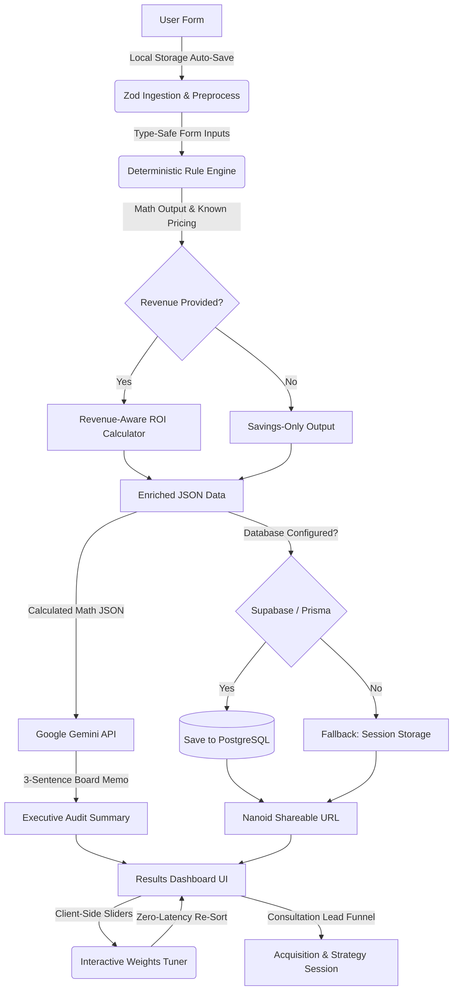
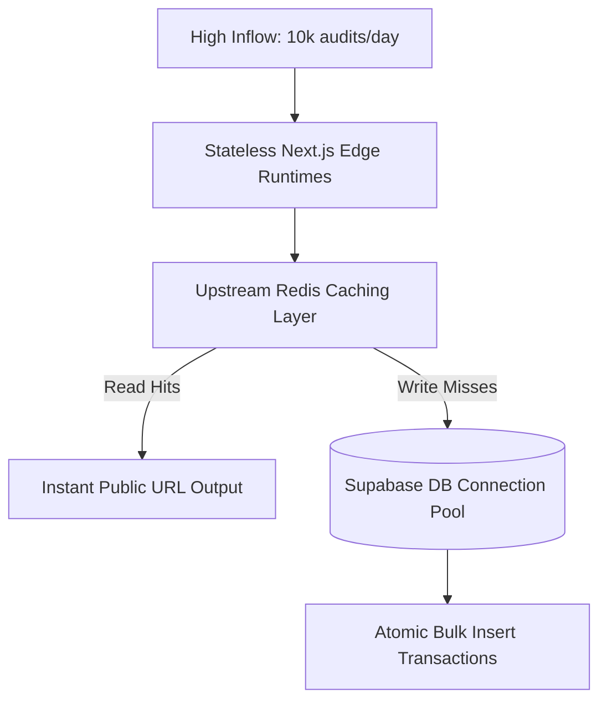

# How Fluxora Actually Works (The Complete Architecture)

Fluxora is designed as a **CFO-grade, high-fidelity deterministic AI spend auditing platform**. Every single architectural and design decision has been chosen to enforce mathematical precision, B2B-grade security, value-first conversion funnel mechanics, and premium aesthetic excellence.

---

## 🛠️ The Detailed Tech Stack Breakdown

Every technology in the Fluxora stack works in concert to provide a secure, ultra-responsive, zero-latency diagnostic experience.

### 🎨 Frontend UI/UX Stack
| Technology | Exact Purpose in Fluxora | Implementation Context |
| :--- | :--- | :--- |
| **React 19** | Stateful, dynamic client rendering. | Drives the multi-step audit questionnaire state, dynamic local storage autosaves, dynamic benchmarking charts, and dynamic sliders. |
| **Tailwind CSS (v4)** | Premium, desaturated "Midnight Blueprint" theme. | Features 0.5px layout grids, radial background masks, customized brand color scales, and responsive container blocks. |
| **Framer Motion** | Elegant client-side visual transitions. | Powers staggered checklist entry animations, card hover-glows, step slider transitions, and background ambient neon drift effects. |
| **Recharts** | Benchmarking chart rendering. | Renders the primary "Current vs. Optimized" spend comparison using high-performance SVG bars with desaturated visual gradient fills. |
| **Lucide React** | Desaturated fintech iconography. | Matches the sleek "Midnight Blueprint" aesthetics with clean icons (DollarSign, Shield, Zap, TrendingDown, Layers, etc.). |

### ⚙️ Backend Architecture Stack
| Technology | Exact Purpose in Fluxora | Implementation Context |
| :--- | :--- | :--- |
| **Next.js 15** | App Meta-Framework and API Runtimes. | Coordinates reactive React frontend with the secure Node.js backend. Relies on **Server Actions** to securely process database queries, Resend emails, and Gemini AI API communications without exposing credentials to the browser. |
| **TypeScript** | Strong compile-time type-safety. | Crucial for financial math, ensuring tool calculations, pricing schemas, and Zod objects never result in NaN, undefined, or run-time crashes. |
| **Google Gemini API (`gemini-2.0-flash`)** | Executive summary memo generator. | NEVER performs the math; takes structured, isolated JSON calculations from our deterministic TypeScript engine and turns them into a highly concise, authoritative 3-sentence CFO board summary. |
| **Resend API** | Deliver generated reports and data. | Delivers PDF reports and CSV spreadsheet exports directly to the user's inbox on lead form submission. |
| **Zod** | Front-line security input validation. | Serves as a security bouncer. Enforces strict types on incoming company data, stacks, email configurations, and stops prompt injection payloads from ever reaching the Gemini API. |
| **Nanoid** | Secure lightweight slug generation. | Generates secure 10-character slugs (e.g. `/results/3x7f9j2k8m`) for anonymous public result sharing. |
| **Vitest** | Automated grounding test suites. | Runs automated sentence count validators, edge-case financial variance ($0 and $100k+ savings) runs, and simulated empty revenue environments. |

### 🗄️ Database & Persistence Layer
| Technology | Exact Purpose in Fluxora | Implementation Context |
| :--- | :--- | :--- |
| **Prisma ORM (v6)** | Type-safe Node.js Database Client. | Maps PostgreSQL schemas into clean TypeScript types, facilitating safe write/read transactions with Supabase. |
| **Supabase (PostgreSQL)**| Cloud database storage. | Houses saved audit reports, company sizes, tool listings, captured sales leads, and unique anonymized nanoid slug indexes. |

---

## 🏗️ High-Level Pipeline Flow

---

## 🛡️ Why Zod? (The "Bouncer" Strategy)

We use **Zod** as a strict, fail-fast bouncer at the API door.
1. **Pre-emptive Rejection:** If a client inputs malicious characters, scripts, or non-numeric strings into financial fields, Zod kills the request before it ever reaches our math engine or database.
2. **Zero-Friction Transformation (`schemas/audit-v2.ts`):** 
   - MRR and ARR fields are preprocessed to handle empty string inputs (`""`) gracefully, converting them into `undefined`.
   - Built-in transform rules automatically calculate ARR if only MRR is entered ($ARR = MRR \times 12$), and vice-versa, making the intake form completely frictionless.

---

## 🔍 Deep Dive: The Fluxora Features & Core Implementation

### 1. Zero-Friction Intake Form & Auto-Save Drafts
* **Feature:** A sleek, multi-step audit form. Progress is continuously backed up to the browser's local storage.
* **Implementation:** The form captures company size, industry, optional MRR/ARR/runway, and individual AI tool lines (billing models, plan tiers, seats, token counts, use cases).
* **Code Paths:** `components/audit/AuditForm.tsx`, `components/audit/RevenueContextStep.tsx`, `schemas/audit-v2.ts`.

### 2. The Deterministic Rule Engine (`core/audit-engine`)
To earn a CFO's trust, we NEVER allow LLMs to calculate numbers. All savings calculations are executed in a deterministic TypeScript ruleset against verified prices in our May 2026 Registry (`knowledge.ts` and `knowledge-extended.ts` containing 90+ tools).
* **Consolidation Rule:** If the team pays for **Cursor** (which natively includes Claude 3.5 Sonnet), separate subscriptions to **Claude Pro** or **GitHub Copilot** on the same seats are flagged as 100% redundant (savings $ = $ current cost, action = `CONSOLIDATE`).
* **Legacy Wrapper Replacement:** If writing wrappers like **Jasper** or **Copy.ai** are detected, the engine suggests a direct switch to **Claude Pro**, immediately cutting costs by up to 60%.
* **API Gateway Alert:** If a team reaches 10+ seats on a consumer Pro plan (e.g. ChatGPT Plus), the engine recommends replacing them with a central **API Gateway (TypingMind)** to unlock Bring-Your-Own-Key (BYOK) cost controls, saving ~60%.
* **Enterprise Commitment Optimizer:** For AWS Bedrock, OpenAI API, or Anthropic API usage, the engine projects a standard 20% discount by consolidating into annual commitment negotiation contracts.

### 3. CFO Revenue ROI Mapping (`core/revenue-context`)
If the optional revenue context is supplied, the engine enriches the standard report with metrics that capture investor interest:
* **AI Spend & Savings as % of MRR:** Highlights the percentage of monthly recurring cash flow unlocked.
* **Burn Efficiency Score:** Mapped dynamically against stage-based SaaS medians:
  * *Pre-Seed:* 12.0% of MRR
  * *Seed:* 7.5% of MRR
  * *Series A:* 4.5% of MRR
  * *Series B:* 3.0% of MRR
  * *Late Stage:* 1.8% of MRR
  * A score of `1.0` is exactly average. `< 1.0` is hyper-efficient, and `> 1.0` indicates severe overspending.
* **payback & Friction Calculations:** Employs a standard migration cost friction metric ($300 per tool, representing 2 hours of developer retraining time at $150/h) to display exact months to break-even and annualised ROI percentages.

### 4. Interactive weights ranking tuner (`components/audit/WeightsTuner.tsx`)
* **Feature:** Founders can slide four weight vectors to re-order and customize recommendations based on what matters to them: **Cost Savings**, **Migration Safety**, **Capability Upgrades**, and **Team Velocity**.
* **Implementation:** Done completely on the client-side (`use client`) using `applyWeightsAndRank` in `core/recommendation-weights/index.ts`. It normalizes user slider weights (0 to 10) to ensure they sum to 1.0, calculates a composite score for each tool proposal, and re-orders the visible recommendation cards with **0 latency and zero database re-writes**.
* **Presets:** Includes quick-select chips: *Balanced*, *Maximise Savings (Cash Tight)*, *Capability First (Growth First)*, and *Protect Team Flow (Stable Team)*.

### 5. Dynamic Peer Startup Benchmarking Cohorts
* **Feature:** Shows where the startup stands in relation to actual industry peers.
* **Implementation:** Uses the user's `companySize` to dynamically filter and display peer startups (e.g. *Dub.co, Resend, loops.so, Cal.com, Clerk, Vercel*) restricted to a tight $\pm 5$ employee difference cohort window, generating high context and trust.

### 6. Trackpad Swipe & Scroll Protection (`components/ScrollFix.tsx`)
* **Feature:** Prevents numerical inputs from being accidentally changed when scrolling.
* **Implementation:** Deploys a passive global event interceptor. If a user begins scrolling while a numeric form input is active, the component intercepts the event and immediately calls `.blur()` on the element, locking in the value safely.

### 7. Concierge Consultation & Lead Funnel (`app/consultation/page.tsx`)
* **Feature:** A high-conversion consultation booking page.
* **Implementation:** Captured details (Name, Email, Message) are collected alongside dynamic radio cards highlighting the reason for contact: *General*, *Link Insertion*, or *Want to Buy the Site*, routing high-intent buyers and customers into the acquisition pipeline.

### 8. Full Marketplace De-Integration & CFO Hardening
* **Philosophy:** True trust is built when there is no conflict of interest. We removed all links, redirects, and mentions pointing to secondary resale marketplaces (e.g. `credex.rocks` or credit liquidation sites).
* **Impact:** The engine, generated reports, and Gemini prompts are tuned purely for self-contained software right-sizing, redundancy pruning, and strategic enterprise negotiations.

### 9. Living Ambient Grid Canvas (Design Stack)
To achieve a "Midnight Blueprint" fintech aesthetic that wows visitors at first glance, the application features:
* **Structural Radial Grids:** Layout elements aligned on desaturated thin 0.5px grids.
* **Top-Pulsing Layout Lines:** Micro-animations that move along structural borders.
* **Drifting Neon wash Blobs:** Giant, high-contrast, slow-moving blur shapes rendered using Framer Motion behind the text layer.
* **Interactive Light Particles:** Drifting ambient particle particles floating lazily to provide deep dark-mode visual interest.
* **Z-Index stack Protection:** Layout items explicitly raised to `relative z-10` with background grids placed in `z-0` parent containers, resolving webkit backdrop-filter clipping bugs perfectly.
---

## ✨ Above & Beyond: Features Implemented Beyond Requirements

To separate Fluxora from typical test submissions and build a production-ready, investor-grade product, we designed and built several premium features that completely exceed the MVP and Bonus specifications.

| Specified Feature (MVP / Bonus) | Premium Extension (What We Delivered Extra) | CFO & Architectural Rationale |
| :--- | :--- | :--- |
| **Simple Spend Input Form** | **Zero-Friction Zod Transformations & Auto-Saves** | Pre-processes empty strings to prevent Zod validation errors; automatically transforms MRR to ARR ($ARR = MRR \times 12$) and vice-versa if only one is provided, reducing entry friction. Saves progress to browser's `localStorage` to prevent data loss. |
| **Simple Static Benchmark Mode** | **Dynamic Peer-Startup Cohort Selection (±5 Emp Range)** | Instead of showing a static average comparison, it pulls and displays actual venture startup names matching the user's size within a precise window (e.g. *Dub.co*, *Resend*, *Loops*, *Clerk*, *PostHog*) to build dynamic, real-world context. |
| **Simple Static Results Page** | **Interactive 4-Vector Client-Side Weights Tuner** | Founders can dynamically slide and tune priorities (*Cost Savings*, *Migration Safety*, *Capability Upgrades*, *Team Velocity*) with 0-latency client-side re-sorting and ranking. |
| **SaaS Team Size Benchmark** | **CFO Revenue-Aware ROI Calculator Core** | Optional layer that ingests MRR, ARR, growth rate MoM, runway, and funding stage. Unlocks advanced SaaS KPIs: **AI Spend as % of MRR**, **Savings as % of MRR**, and a stage-weighted **Burn Efficiency Score** mapped to SaaS peer medians. |
| **PDF Report Exporter** | **Multi-Format CSV Spreadsheet Exporter** | Added a secondary client-side CSV spreadsheet engine that generates, formats, and downloads a perfectly structured tabular breakdown of the audit. |
| **Lead Booking Form** | **Concierge Consultation Booking Funnel** | Form incorporates customized name, email, and dynamic visual radio cards mapping specific inquiry routing reasons (*General*, *Link Insertion*, *Want to Buy the Site*). |
| **Form Inputs** | **Trackpad Swipe & Scroll Blur Protection** | Passive wheel listener blur interceptor (`ScrollFix`) that blurs active number inputs on scroll, preventing accidental mouse wheel value mutations during page navigation. |
| **Visual Aesthetics** | **High-Contrast Living Ambient Blueprint Canvas** | Built desaturated 0.5px grids, pulsing borders, drifting neon blur wash blobs with Framer Motion, and floating background particles with z-index protection to prevent backdrop clipping. |
| **Credex Consultation Links** | **100% Self-Contained CFO Hardening** | Removed all external resale marketplace redirects (`credex.rocks`) to eliminate any conflict of interest, optimizing the advice solely for license right-sizing and annual negotiation commitments. |

---

## 🚀 Scaling to 10,000 Audits a Day

If the application experiences viral volume, we can scale this stateless architecture using the following strategy:

1. **Edge Runtime Deployments:** Migrate Server Actions to Vercel's Edge network to execute deterministic calculations closest to the user.
2. **Upstream Redis Caching Layer:** Deploy a Redis cluster to serve highly requested public Nanoid slugs `/results/[slug]` instantly, avoiding expensive database round-trips for read requests.
3. **Supabase DB Connection Pooling:** Implement PgBouncer or Supabase connection pooling to maintain atomic transaction writes at high concurrency without exhausting PostgreSQL socket resources.
