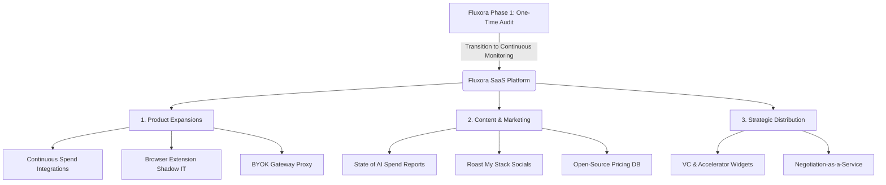

# Fluxora Strategic Roadmap: From B2B Utility to High-Value SaaS Platform

Fluxora's current deterministic engine and revenue-aware audit models provide an incredibly strong, professional-grade portfolio foundation. However, to transition Fluxora from a high-fidelity "one-time audit calculator" into a recurring, high-retention SaaS business, viral platform, and investment-grade acquisition engine, we must shift from providing **one-time diagnostic value** to **continuous, recurring value and strong network effects**.

This document outlines the strategic roadmap and expansion playbook to scale Fluxora into a broadly promotable enterprise and consumer platform.

---

## 🗺️ The Strategic Roadmap at a Glance



---

## 🛠️ Phase 1: Product Expansions (From "Tool" to "Platform")

To build a high-retention, high-value recurring software business, we must replace manual audit updates with automated continuous tracking and inline enforcement.

### 🔌 1. Continuous Spend Monitoring (Automated Financial Integrations)
Instead of forcing a CFO or VP of Engineering to manually fill out their team's SaaS stacks, Fluxora connects directly to the transaction sources to automate discovery.
* **The Implementation:** Develop secure OAuth API connectors to standard accounting platforms (**QuickBooks**, **Xero**) and modern corporate credit card APIs (**Brex**, **Ramp**, **Stripe**, **Mercury**).
* **The Value Loop:** Fluxora scans incoming transactions daily. The moment a new transaction containing an AI vendor string (e.g., `"Anthropic"`, `"Cursor"`, `"Jasper"`, `"v0.dev"`) is identified, Fluxora triggers a background evaluation.
* **Sticky Alerts:** Instantly sends an automated Slack/Email alert to the Finance Lead: 
  > *"Warning: An employee just charged $20 to Windsurf on card ending in 4102. The company already pays for an Enterprise Cursor Team subscription. [Consolidate with 1-Click]()."*
* **Technical Path:** Secure API endpoints under `/api/integrations/ramp` utilizing webhook handlers and standard vendor-string mapping.

### 🌐 2. The Browser Extension (Shadow IT Detection)
Many developers and employees sign up for AI tools on their personal credit cards or personal accounts using their corporate email addresses, bypassing accounting detection completely.
* **The Implementation:** Build a lightweight, privacy-focused Chrome/Firefox extension deployed across company-managed devices (via Google Workspace MDM).
* **The Value Loop:** The extension runs locally in the browser, monitoring active domain visits. If an employee visits sign-up or billing pages of redundant AI software, a subtle overlay pops up:
  > 💡 **Fluxora Security Notification:** *"Wait! Your team already has 40 active seats on Cursor. You don't need a personal ChatGPT Plus account to access advanced models. Click here to request your official Cursor seat."*
* **Security & Privacy:** The extension strictly whitelist-matches AI domain lists from our pricing database, maintaining user privacy by ignoring all other non-work related browsing.

### 🔑 3. The "Bring Your Own Key" (BYOK) Gateway
As companies write custom internal AI tools, API token costs easily spiral out of control. Individual developers frequently use keys without centralized monitoring or rate-limiting.
* **The Implementation:** Build a lightweight, high-performance API proxy gateway (leveraging Cloudflare Workers or Vercel Edge Functions).
* **The Value Loop:** Instead of developers calling OpenAI, Anthropic, or OpenRouter directly, they route their calls through their company's secure Fluxora Proxy:
  `https://gateway.fluxora.com/v1/chat/completions`
* **Real-Time Cost Control:** The gateway inspects the incoming auth token, verifies team budgets, enforces real-time token caps, dynamically caches repeated prompts, and masks PII (Personally Identifiable Information) before it hits third-party model providers.
* **ROI Dashboard:** Gives the CTO a centralized, real-time visualization of prompt-by-prompt costs, model latency, and token efficiency.

---

## 📣 Phase 2: Content & Marketing Engines (How to Advertise & Acquire)

Viral growth loops and data-led authority marketing represent the most capital-efficient ways to scale the top of our acquisition funnel.

### 📊 1. "The State of AI Spend" Report (Data-Led Marketing)
As hundreds of startup founders, CFOs, and technical leaders run free audits on Fluxora, we accumulate a proprietary, high-value dataset on real-world business AI consumption.
* **The Playbook:** Every quarter, we aggregate and anonymize this audit data. We compile it into a beautifully formatted, highly visual interactive web page and PDF report:
  > **"The Q3 2026 Startup AI Spend Report: Why 40% of Seed Companies are Wasting $5,000/Month on Redundant LLMs."**
* **The Distribution:** This report is highly attractive to tier-1 tech publications (TechCrunch, VentureBeat, Sifted), engineering newsletters (The Pragmatic Engineer, TLDR), and LinkedIn finance influencers.
* **Organic Leads:** Readers download the full PDF report by inputting their work email, which feeds directly into our B2B sales pipeline.

### 💬 2. "Roast My Stack" Social Engine
Turn our complex deterministic audit calculations into highly visual, shareable scorecards that trigger founders' competitive and collaborative instincts.
* **The Playbook:** On the results screen, generate a sleek, desaturated "AI Burn Efficiency Card" with a clear score (e.g., `1.2` representing 20% overspend).
* **Viral Hook:** Add a one-click share button:
  > *"I just scored a 1.2 on my AI Burn Efficiency—roast my stack! Fluxora showed me how to save $1,200/mo by cutting redundant Claude seats. What's your score? [audit.fluxora.com]()*"
* **Target Audience:** Technical founders on X (Twitter), LinkedIn, and Indie Hackers thrive on showing off structural optimization and efficiency. Each shared post serves as a high-trust referral to the platform.

### 📖 3. Open-Source the Pricing Knowledge Base
Take our comprehensive pricing registry (`knowledge.ts` and `knowledge-extended.ts` containing 90+ enterprise AI tools) and transform it into a public, searchable directory.
* **The Playbook:** Build a public directory path (`/tools`) that functions as "The Wikipedia of AI Tool Pricing."
* **SEO Powerhouse:** Each tool receives an optimized, programmatic landing page comparing its team tiers, individual plans, API costs, and typical redundancy vectors (e.g., `/tools/cursor-vs-copilot`).
* **Inbound Funnel:** By capturing search queries like *"does cursor team plan include Claude Sonnet"* or *"Claude Pro team seats pricing"*, we capture ultra-high intent search engine traffic and immediately offer them a *"Run a Free 60-Second AI Audit"* button at the top of the screen.

---

## 🤝 Phase 3: Strategic Distribution & Partnerships

Leveraging third-party networks and existing administrative trust unlocks compound distribution without massive ad budgets.

### 🏢 1. VC & Accelerator "Widgets"
Venture Capital firms and startup accelerators (Y Combinator, Techstars, Sequoia, etc.) are highly incentivized to preserve their portfolio companies' cash runways.
* **The Playbook:** Package our deterministic engine as a modular embeddable widget or custom, co-branded portal:
  `https://ycombinator.fluxora.com`
* **The Pitch:** We offer VC firms a dedicated interface where their portfolio startups can run a mandatory or voluntary "Fluxora AI Audit" during onboarding or before board meetings.
* **Portfolio Health Dashboard:** The VC receives an aggregate, high-level dashboard displaying the total monthly capital saved across their entire portfolio, cementing Fluxora as an essential capital efficiency partner.

### 💰 2. Negotiation-as-a-Service (Direct Monetization)
Identifying savings is only half the battle; many finance teams simply do not have the time or specialized expertise to negotiate custom contracts with enterprise AI reps.
* **The Playbook:** Add a premium, low-friction button to the audit results screen:
  > 💸 *"Fluxora identified $12,000 in annual savings. For a simple 10% cut of actual money saved, our expert negotiation desk will handle the contract migration and vendor negotiations for you. Zero upfront cost."*
* **Business Model:** A high-margin service engine that leverages our data to guarantee savings. Once the volume of negotiations increases, we automate the bidding process using pre-drafted, data-backed vendor-matching scripts.

---

## 🚀 The Launch Playbook

To ensure maximum organic traction on day one, we coordinate two high-impact launches targeted directly at tech-savvy, efficiency-minded audiences.

```
┌────────────────────────────────────────────────────────┐
│               THE DUAL-LAUNCH STRATEGY                 │
├──────────────────────────┬─────────────────────────────┤
│   🚀 PRODUCT HUNT        │   ⚡ HACKER NEWS (SHOW HN)  │
├──────────────────────────┼─────────────────────────────┤
│ • Targeted at CFOs, PMs, │ • Targeted at Developers,   │
│   and Growth Marketers   │   CTOs, and Tech Founders   │
│ • "CFO-Grade B2B Fintech │ • "Built a deterministic    │
│   Optimization SaaS"     │   math engine to stop LLM   │
│ • Focus: ROI, Runway,    │   pricing overcharge"       │
│   and Cost Control       │ • Focus: Security, Math,    │
│   Dashboards             │   and Open-Source Data      │
└──────────────────────────┴─────────────────────────────┘
```

### 1. Product Hunt Launch (The B2B Fintech Pivot)
* **Positioning:** Frame Fluxora strictly as a high-fidelity CFO/Fintech optimization platform, completely distinct from generic "AI wrappers."
* **Highlights:** Highlight the deterministic mathematical logic, the 90+ verified tool knowledge base, and the revenue-aware ROI benchmarks.
* **Launch Title:** *Fluxora 2.0 – The CFO's Deterministic Audit Engine for Company AI Spend.*

### 2. Hacker News ("Show HN") Launch (The Tech Nerd Pivot)
* **Positioning:** Technical founders and engineers despise administrative waste and superficial AI hype. Frame it around the mechanics of the engine itself.
* **Launch Title:** *Show HN: I built a deterministic engine to audit and find redundant company AI seats.*
* **Storytelling Intro:** Write a highly compelling, transparent top comment explaining:
  - Why we built the system using strict TS math rather than unreliable LLM API prompts.
  - The security architecture (strict Zod validation filters).
  - Openly discussing the pricing data we aggregated and offering the community to contribute via PRs.

---

## ⚖️ Strategic Trade-offs: Integrations vs. Marketing & Virality

To help you decide which route to prioritize, here is a detailed breakdown of the execution trade-offs, engineering requirements, and strategic value of each direction.

| Expansion Route | 🛠️ Engineering Complexity | 🚀 Time to Market | 📈 Growth & Distribution Model | 🔒 Long-Term Defensibility |
| :--- | :--- | :--- | :--- | :--- |
| **Route A: Financial Integrations & SaaS** <br>*(QuickBooks, Ramp, Stripe, BYOK Gateway)* | **High** (Requires strict OAuth, security compliance, webhook syncs, API routing) | **Slow** (2–4 weeks for secure, bulletproof financial integrations) | **Direct Sales & Retention-Driven** <br>(High customer LTV, zero churn, extremely sticky B2B SaaS) | **Very High** (Direct connection to financial ledger makes it a permanent back-office tool) |
| **Route B: Content, Viral Marketing & Distribution Machine** <br>*(State of AI Spend, Roast My Stack, Public Wiki)* | **Low** (Mainly UI tweaks, schema generation, social card renders, and SEO pages) | **Fast** (3–7 days to spin up SEO directories, social share tools, and reports) | **Organic & Virally-Driven** <br>(High volume of viral traffic, instant visibility, zero paid ad spend) | **Medium** (Relies on data freshness and keeping the viral loops novel) |

---

## 🔮 Which Route Excites You Most?

### 🔋 Option A: The Financial Integration & SaaS Engine
* **Why do it:** You want to build a highly defensible, automated B2B SaaS tool. By connecting directly to Stripe, Ramp, and corporate cards, Fluxora becomes a set-and-forget financial utility that business owners pay for month after month because it operates quietly in the background, proactively flagging cost leaks.
* **Perfect if:** You love deep API integrations, Webhooks, backend state-management, security protocols, and want to pitch this as a high-revenue software product.

### ⚡ Option B: The Content, Viral Marketing & Distribution Machine
* **Why do it:** You want immediate organic traction, high visibility, and maximum reach. By launching an open-source pricing wiki, you capture highly-lucrative SEO search intents. By deploying "Roast My Stack" shareable visuals, you let the community market your tool for you, driving massive, free B2B referral loops.
* **Perfect if:** You enjoy growth engineering, viral loop mechanics, elegant UI/UX design, SEO strategy, and want to see your project trend on X (Twitter), LinkedIn, and Hacker News.

---

> [!NOTE]
> This roadmap has been saved to the root of your workspace as `FUTURE_PLANS.md`. You can review it, modify it, or use it as a foundation for your upcoming development cycles.

> [!TIP]
> Both routes have high leverage. A common, highly effective hybrid approach is to build the **Marketing & Virality engine first** to capture thousands of email signups and interest, and then upsell those users on the **Automated Financial Integrations** once they experience the value of the manual audit.
