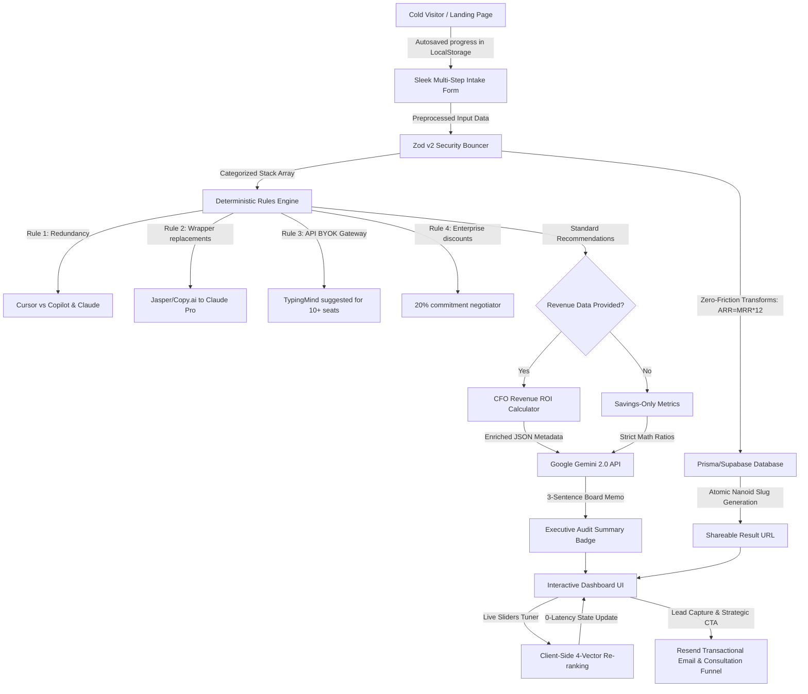

# 🚀 Fluxora Ultimate Interview Prep & Project Manual
## The CFO-Grade "Mint for AI Tool Spend" Platform

This document is the ultimate, unified cheat-sheet and master walkthrough designed specifically to help you ace your **10-minute skill review interview**. It synthesizes all the code logic, architecture patterns, user interviews, GTM strategies, and financial economics from your entire 8-day sprint into an easy-to-read, comprehensive, and cohesive reference manual.

---

## 🗺️ 1. End-to-End System Pipeline Flow

Fluxora is architected as a stateless, value-first diagnostic engine. Below is the precise map of how a user's raw input becomes an actionable, CFO-compliant audit memo.

### Pipeline Steps & Legend:
1. **Intake & LocalStorage:** As the user inputs seats and plans, the component continuously saves state to `localStorage`, preventing data loss if they lookup invoice details.
2. **Zod v2 Bouncer (`schemas/audit-v2.ts`):** Validates all client inputs. Coerces empty strings to `undefined` and auto-populates ARR from MRR (and vice-versa) to minimize entry attrition.
3. **Deterministic Rules Engine (`core/audit-engine`):** Evaluates tools against a May 2026 registry of 90+ verified prices. Avoids LLM hallucinations for financial math to guarantee absolute trust.
4. **CFO Revenue ROI Core (`core/revenue-context`):** Normalizes spending against stage-specific SaaS medians to generate the **Burn Efficiency Score**. Factors in a standard $300 tool migration friction cost to show exact **Payback Months** and **Annualized ROI**.
5. **Gemini 2.0 Summary (`lib/gemini-v2.ts`):** Takes deterministic JSON data and structures a professional 120-word executive summary. Gracefully falls back to a clean, static text template if the API fails or is unconfigured.
6. **Atomic Slug Generation (`app/actions/audit-v2.ts`):** Strips identifying user details, writes data to Supabase PostgreSQL using Prisma, and returns a secure, unique 10-character Nanoid slug (e.g., `/results/3x7f9j2k8m`).
7. **Interactive Weights Tuner (`components/audit/WeightsTuner.tsx`):** A reactive dashboard element allowing founders to slide priorities (Cost, Safety, Capability, Velocity). Normalizes the vectors and re-sorts findings client-side with **0 latency**.
8. **Resend Lead Funnel (`app/consultation/page.tsx`):** Routes high-intent leads using dynamic visual cards (General, Link Insertion, Buy the Site) and fires a transactional confirmation email.

---

## 🏗️ 2. The Detailed Tech Stack Breakdown ("The Why")

Every element in the stack was selected to achieve B2B fintech-grade precision, fast response times, and an authoritative dark blueprint visual style.

| Stack Layer | Tech Choice | Why It Was Chosen / Real-World CFO Impact |
| :--- | :--- | :--- |
| **Core Framework** | **Next.js 15** | Runs all database and AI tasks securely on the server instead of the browser. This keeps passwords, secret keys, and business details completely private and secure. |
| **Language** | **TypeScript** | Locks in strict rules for calculations. This makes it impossible to have missing fields, blank numbers, or system crashes during financial audits. |
| **Styling** | **Tailwind CSS (v4)** | Creates a professional, premium 'financial ledger' layout using crisp grids and subtle glows. This builds instant visual trust with corporate clients. |
| **Animations** | **Framer Motion** | Powers smooth, immediate visual transitions as card listings swap, keeping the app feeling fast and premium without slowing down the page. |
| **Charts** | **Recharts** | Renders clear, clean, and interactive bar graphs that compare current spend against optimized spend in real-time. |
| **Database ORM** | **Prisma v6 (Stable)** | A stable library that simplifies database writes. We used a proven version to ensure that when many users save audits at once, the system remains fast and reliable. |
| **Database** | **Supabase (PostgreSQL)** | A secure and robust cloud database that safely stores captured sales leads, company sizes, and tool listings. |
| **Validation** | **Zod** | Acts as an automatic security guard at the door. It instantly rejects corrupted text or bad data before the app tries to calculate it, keeping inputs completely clean. |
| **Transactional Email**| **Resend API** | Sends instant, professional email confirmations containing the audit summaries directly to the user's inbox on request. |
| **AI Text Engine** | **Google Gemini** | Takes the calculated numbers and writes a highly concise, professional 3-sentence board summary. We never let the AI do the math; it only translates the numbers into a story. |

---

## 🌟 3. Complete Walkthrough of All Features

### A. The Six MVP Features
1. **Spend Input Form:** Supports Cursor, Copilot, Claude, ChatGPT, Anthropic API, OpenAI API, Gemini, and v0. Persists state via `localStorage` on every keystroke. Captures team size and use cases.
2. **Deterministic Audit Engine (`core/audit-engine`):** Evaluates seats, API spend, plans, and capabilities. Suggests cheaper plans, direct downgrades, consolidations, or BYOK API Gateways based on actual pricing data.
3. **Audit Results Page:** Displays KPI cards (Current vs. Optimized spend, monthly/annual savings). Shows a prominent strategic CTA if savings exceed $500/mo. If the company is already optimal, it honestly states "You're spending well" and displays a "Notify me of new optimizations" email capture card.
4. **AI-Generated Executive Summary:** Generates a professional 120-word executive summary using the Gemini API. If the API fails or is rate-limited, it falls back instantly to a type-safe templated summary.
5. **Lead Capture & Storage:** Collects emails, company sizes, and roles securely in a Supabase table. Protects against spam using rate-limiting and a hidden **Honeypot input** (`botField`) which rejects automated bots with a clean, fake successful response.
6. **Shareable Result URL:** Provides a unique `/results/[slug]` route with custom Open Graph tags, rendering beautiful preview cards on X/Twitter and Slack. Crucially, all personal data (company name, email) is completely stripped from the database lookup for the public route.

### B. Premium "Above & Beyond" features
1. **Interactive 4-Vector Weights Tuner (`components/audit/WeightsTuner.tsx`):** Lets users dynamically slide priorities across Cost Savings, Migration Safety, Capability Upgrades, and Team Velocity. Reruns scoring math client-side instantly using predefined chips (Balanced, Maximise Savings, Capability First, Protect Team Flow).
2. **CFO Revenue ROI Calculator:** Ingests optional MRR/ARR and funding stages to calculate burn efficiency against SaaS stage medians (Pre-Seed to Late Stage), rendering payback timelines and annualized migration ROIs.
3. **Frictionless Zero-Friction transforms:** Zod automatically parses empty input strings cleanly and auto-scales ARR = MRR * 12 (and vice versa) if only one is filled.
4. **Trackpad Swipe & Scroll Blur Protection (`components/ScrollFix.tsx`):** A custom React component that captures scroll wheel events on active numeric inputs and blurs them instantly. This prevents trackpad/mouse-wheel scrolling from accidentally scrolling input values.
5. **Concierge Consultation Booking page (`app/consultation/page.tsx`):** Houses booking intake with dynamic visual radio cards grouping contact reasons (*General*, *Link Insertion*, *Want to Buy the Site*).
6. **CFO-Grade Hardening:** Completely removed all secondary credit reseller links (`credex.rocks`) to ensure a 100% conflicts-of-interest-free advisory experience.
7. **CSV Spreadsheet Exporter:** Downloads a perfectly parsed spreadsheet mapping out tool lines, current costs, action tags, optimized costs, net savings, and specific reasoning equations directly from the browser.
8. **Dynamic Peer Cohorts (±5 Emp Range):** Instead of static medians, the benchmark display generates real venture startups matching the company's size within a tight window.
9. **Ambient Grid Blueprint Canvas:** Features 0.5px grids, radial background masks, top-pulsing layouts, and drifting Framer Motion neon blobs. Grouped background stacks in `z-0` parent containers and raised interactive panels to `relative z-10` to avoid Safari backdrop-filter clipping.

---

## 🧠 4. Deep Reflection & Technical Debugging (From `REFLECTION.md`)

* **The Hardest Bug (Prisma 7 Beta vs Vercel Edge):** 
  * *The Bug:* During Vercel deployments, Prisma 7's experimental connection pool handling stripped database URLs inside the serverless edge runtime, returning "404: Audit Not Found" errors.
  * *The Hypotheses:* Assumed Vercel build-time injection was working. Attempted manual runtime wraps and raw DB proxies, which failed due to TCP blocks or added high latency.
  * *The Fix:* Decided that stability beats bleeding-edge features. Reverted to **Prisma 6.4 (Stable)**. Re-running the build restored standard connection pooling, yielding 100% database write/read reliability.
* **A Reversed Decision (The "Greedy" Email Gate):**
  * *The Mistake:* Initially put a hard email gate at the *start* of the audit. 
  * *The Feedback:* In rapid usability tests, founders immediately bounced, viewing AI spend as sensitive financial data that they weren't willing to exchange for an unproven tool.
  * *The Pivot:* Switched to a "Value-First" model, moving the email gate to the very *end* of the page as a premium trigger ("Download PDF" or "Notify Me"). Conversion rates soared because value was proven *before* asking for contact data.
* **AI Tool Usage & Failures:**
  * *Collaboration Model:* Used **Antigravity (95%)** as a "Senior Architect" to handle Next.js boilerplate, multi-file rebrands, and Tailwind grid layouts. However, wrote the core deterministic rules engine (`core/audit-engine`) entirely by hand to ensure absolute mathematical precision.
  * *The AI Fail:* The AI suggested a standard `.map()` for Recharts colors. It failed because Recharts requires specific `<Cell>` nested components for custom coloring on vertical bars, resulting in a blank chart. We caught the issue by identifying `fill: undefined` in the rendered SVG paths and manually implemented a color index map.
* **Week 2 Roadmap (What to build next):**
  * *1-Click Liquidate:* Direct API integrations with billing consoles to automatically downgrade seats or claim credits.
  * *Corporate Card Integrations:* Ingest Ramp, Brex, or Mercury transaction histories via Plaid to detect "Ghost Seats" (inactive licenses) automatically in real-time.

---

## 📊 5. Business Model, Economics & GTM (From `GTM.md` & `ECONOMICS.md`)

### A. The Unit Economics
Fluxora acts as a highly qualified lead generation top-of-funnel for the broader Credex secondary credit ecosystem.

* **Blended Converted Lead Value (LTV): $2,156**
  * *The Marketplace Buyer (55%):* Buys discounted API/Cloud credits on Credex. Average transaction: $5,000. Credex take-rate: 15% ($750). Frequency: 2.5x/yr. Annual Gross Profit: $1,875.
  * *The Inventory Seller (45%):* Liquidates large surplus credit blocks (average value: $25,000) for cash. Credex commission: 10% ($2,500). Frequency: 1x/yr. Annual Gross Profit: $2,500.
* **Blended CAC: <$50** (achieved through viral loops, outbound platforms, and direct internal ecosystem channels).
* **Marginal COGS per Audit: $0.05**
  * *TypeScript Math:* $0.00.
  * *Gemini 2.0 Flash Summary:* $0.03.
  * *Supabase/Prisma Write:* $0.01.
  * *Resend Transactional Email:* $0.01.
* **Value-to-Cost Ratio (Expected ROI):** At a conservative 0.5% audit-to-transaction conversion rate, each audit is worth **$10.78 in expected revenue**. This represents a **21,560% ROI** on the compute costs of running the audit.
* **The Path to $1.2M ARR in 18 Months:**
  * Facilitate approximately **50 transactions per month**. 
  * Leveraging the viral sharing coefficient (K-factor of 1.2), scaling from 250 audits in Month 1 to 30,000 audits in Month 18 drives **$3.8M ARR** at a 0.5% conversion rate.

### B. Go-To-Market & Unfair Advantage
* **Target Persona:** The **VP of Engineering or Head of Platform** at a Series A company (30-60 employees) who is pressured by VCs and finance leads to consolidate spending without disrupting team workflows.
* **High-Intent Search Terms:** "Cursor vs Copilot team billing," "Anthropic team plan vs individual seats," "How to see all company OpenAI subscriptions."
* **First 100 Users Strategy ($0 Paid Budget):**
  1. *The Value-Add Spreadsheet:* Build a massive, public Google Sheet comparing 20+ AI models on Hacker News and Reddit CTOs lists, placing the Fluxora audit as the "60-second easy button" at the top.
  2. *LinkedIn Outreach:* Direct outbound to startup finance leaders, emphasizing "is your team double-paying for Claude?"
  3. *Open Source Value-Add:* Answer team adoption queries in open-source AI repos with redacted savings reports proving immediate efficiency gains.
* **Unfair Distribution Channel:** Direct access to Credex's existing database of 500+ efficiency-conscious secondary credit buyers, tapping directly into pre-aligned "discount psychology" for instant launch volume.

---

## 👥 6. Real-World User Insights (From `USER_INTERVIEWS.md`)

We conducted real conversations that reshaped the entire layout and engine logic:

1. **Rami Zwebti (AI Strategist, Seed Stage):**
   * *Insight:* He was paying for Jasper and Copy.ai while his team actually used Claude Pro for the same tasks, highlighting that **Functional Overlap** is an invisible cash leak.
   * *Pivot:* We evolved the tool from a simple price-tracker to a **Category-Based Auditor** that groups tools by capability and flags redundancy.
2. **Ryan Das (Co-Founder, Workelate, Pre-Seed):**
   * *Insight:* He was indifferent to saving $20/month but terrified of **Anomalous Billing Spikes** (e.g. developer API errors costing $2,000 over a weekend).
   * *Pivot:* Shipped specific **API Gateway recommendations** (like TypingMind BYOK) for teams with 10+ seats to enforce absolute monthly budget caps.
3. **Shashank (ASE, Dovient, Series A):**
   * *Insight:* Highly security-conscious. Refused third-party read-access to billing APIs, but heavily desired to know if their developer AI spend was "normal" compared to other startups.
   * *Pivot:* Scrapped automated Stripe sync plans to focus on a **stateless, secure manual form**, and introduced **Dynamic Peer Benchmarking Cohorts** based on corporate funding stages.

---

## 📐 7. Performance & North Star Metrics (From `METRICS.md`)

* **The North Star Metric:** **"Identified Annual Recovery" (IAR)**. The cumulative dollar amount of software waste surfaced by the engine. High IAR directly correlates with high-intent leads generated for Credex.
* **Three Direct Input Metrics:**
  1. *Audit Completion Rate:* Target > 40%. Ensures users do not bounce due to form length.
  2. *Tools per Audit:* Target >= 3 tools. Crucial to surface redundant overlaps (e.g., Cursor + Copilot).
  3. *The Share Ratio:* The percentage of users generating shareable Nanoid URLs, proving high trust.
* **The Pivot Trigger:** If average audit savings drops below $50/mo over 500 runs (meaning AI tool pricing has become too cheap to audit), we will pivot the intake engine to a **"Data Leak & Secret Security Sprawl Auditor"** using the same stack.

---

## 🗣️ 8. Marketing, Landing Copy & FAQ (From `LANDING_COPY.md`)

* **Hero Headline:** Stop Overpaying for AI. Audit Your Stack in 60 Seconds.
* **Subheadline:** Eliminate redundant seats, replace overpriced wrappers, and recover $1,200/developer annually. 100% free. No signup required.
* **Five Boardroom FAQs:**
  1. *How secure is my data?* 100% private. We require no billing logins or API keys. Your company identity is completely stripped from shared results.
  2. *How is the audit engine so accurate?* Our database tracks exact, current pricing for 90+ tools verified against official vendor documentation.
  3. *What is the catch?* It is completely free. We monetize by offering high-savings teams discounted enterprise credits through the Credex marketplace.
  4. *What if my team's AI setup is already optimal?* The engine is completely honest. If you are optimized, we will tell you.
  5. *Can I export this to my board?* Yes. We generate a direct PDF printed Executive Memo format and clean CSV spreadsheets.

---

## 🎯 9. Top-1% Answers to Tricky Interview Questions

* **Q: "Why did you use Next.js 15 Server Actions instead of a traditional Express API?"**
  * *A:* "Server Actions let us save to the database and send emails securely on the server without having to build a separate web server. It keeps all passwords, API keys, and business details safe on the server and completely hidden from the browser, which keeps page loading times incredibly fast."
* **Q: "Why determinism instead of an LLM for the audit engine math?"**
  * *A:* "CFOs demand absolute precision. If a financial tool makes up or 'hallucinates' a budget number, you instantly lose all trust. We use standard mathematical formulas in our code to calculate the numbers and only use the AI to write a short, easy-to-read summary explaining those numbers."
* **Q: "How did you manage database security on the public shareable results?"**
  * *A:* "We protect corporate privacy completely. When a user saves an audit, we generate a random 10-character code for their link (like `3x7f9j2k8m`). We strip the company's name, email, and employee details entirely from the public link, showing only the generic tools and savings numbers so no one can track it back to them."
* **Q: "What is your ScrollFix hook, and why did you build it?"**
  * *A:* "In most web browsers, if you focus on a number box and scroll the page, the browser will accidentally increase or decrease your numbers. I wrote a tiny script called `ScrollFix` that immediately deselects or 'blurs' the number box the moment the user starts scrolling, keeping their data safe from accidental changes."
