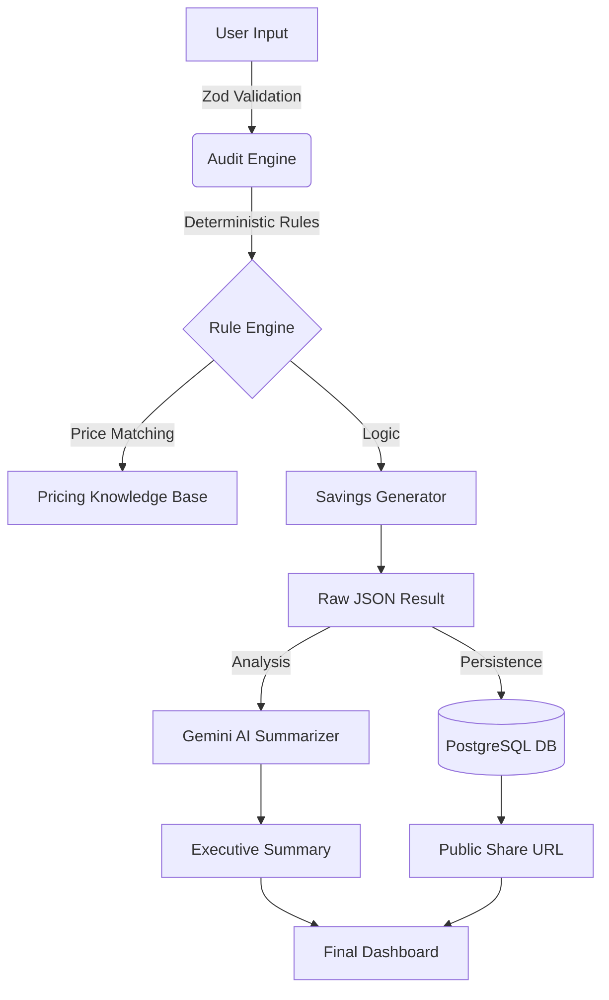

# Technical Architecture & Pipeline

Fluxora is built with a **Deterministic-First** philosophy. In a market saturated with "hallucinating" AI agents, we prioritize financial accuracy over probabilistic estimates. Our architecture ensures that every dollar found is defensible to a CFO.

## 🏗️ High-Level System Overview

## 🛡️ Architectural Decision: Why Zod? (vs. SQL)

A common question is: *"Why use Zod for validation instead of just relying on SQL constraints?"* 

We use **Zod** as the primary validation layer for four critical reasons:
1. **Early Failure (Fail-Fast)**: Zod catches "dirty" input (e.g., text in a number field) at the application boundary. If we waited for SQL, we would have already executed complex JavaScript math on invalid data, leading to `NaN` errors or server crashes.
2. **Type Safety**: Zod automatically generates TypeScript types. This ensures that the **Audit Engine** receives data that is 100% compliant with our expected schemas, reducing "undefined" bugs.
3. **Complex Logic**: SQL is great for checking types, but Zod is better for business logic validation (e.g., "The seat count must be greater than 1 if the plan is 'Enterprise'").
4. **User Experience**: Zod allows us to return human-readable error messages to the frontend instantly without waiting for a database round-trip.

## 🏗️ The Fluxora Pipeline: Step-by-Step

Here is the exact journey of a single audit:

#### 1. User Input (The Starting Line)
The user interacts with the `AuditForm.tsx`. They add their tools (e.g., Cursor, ChatGPT, AWS). This is "untrusted" data living in the browser's memory.

#### 2. Zod Validation (The Guard)
As soon as the user hits "Generate Audit," the form data is sent to a **Next.js Server Action**. Zod intercepts it. 
*   **Action**: It validates that `tools` is an array and that every `seat` count is a valid integer.
*   **Result**: Clean, validated JSON data is passed to the Audit Engine.

#### 3. Audit Engine (The Orchestrator)
This is the "Brain" of the app. It takes the clean user data and initiates the analysis. It doesn't do the math itself; it manages the flow between the **Pricing Knowledge Base** and the **Rule Engine**.

#### 4. Pricing Knowledge Base (The Source of Truth)
Located in `core/audit-engine/knowledge.ts`, this is a curated registry of real-world 2026 pricing. 
*   **Step**: The engine looks up each tool the user entered (e.g., "ChatGPT Plus") and finds its official retail price ($20/seat).

#### 5. Rule Engine (The Logic Layer)
This is where the **Deterministic Rules** live. Unlike AI, which "guesses," the Rule Engine uses strict `if/then` logic:
*   *Rule Example*: `if (user has Cursor) AND (user has GitHub Copilot) THEN (Flag as OVERLAP)`.
*   *Rule Example*: `if (user is paying $30 for a $20 plan) THEN (Flag as PRICE_ANOMALY)`.

#### 6. Savings Generator (The Math Engine)
It compares the **User Input** against the **Pricing Knowledge Base**.
*   **Logic**: `(Current Monthly Spend) - (Optimized Monthly Spend) = Monthly Savings`.
*   It aggregates all flags from the Rule Engine into a final "Potential Recovery" dollar amount.

#### 7. Raw JSON Result (The Intermediate State)
The engine produces a complex JSON object containing:
*   Total current spend.
*   Total optimized spend.
*   A list of `recommendations` (Action, Savings, and Reasoning).

#### 8. PostgreSQL DB (Persistence)
We take that Raw JSON and save it to our database.
*   **Why?**: This creates **Persistence**. It generates a unique `publicSlug` (like `flux-123xyz`). This allows the user to refresh the page or share the link with their team without losing the data.

#### 9. Gemini AI Summarizer (The Translator)
We send the **Raw JSON Result** to Google Gemini 1.5 Flash. 
*   **Role**: Gemini acts as a "Financial Analyst." It reads the raw numbers and writes a 2-paragraph **Executive Summary** in plain English (e.g., *"Your team is double-paying for coding assistants..."*).

#### 10. Public Share URL (The Viral Hook)
The app generates a unique link: `fluxora.app/results/flux-123xyz`.
*   When someone clicks this, the app pulls the data back from **PostgreSQL** using that slug.

#### 11. Final Dashboard (The Visual Experience)
The data is rendered in the `ResultsClient.tsx`. 
*   **Components**: Charts, **Recommendation Cards**, the **AI Executive Summary**, and the **Benchmark Card**.
*   **Final Step**: The user can now export this to a PDF or click the "Fluxora Marketplace" CTA to start recovering that money.

---

### 📊 Summary Table

| Step | Component | Input | Output |
| :--- | :--- | :--- | :--- |
| **Ingestion** | `AuditForm` | User Clicks | Form Data |
| **Sanitization** | **Zod** | Form Data | Validated JSON |
| **Analysis** | **Audit Engine** | Validated JSON | Savings Logic |
| **Intelligence** | **Gemini AI** | Raw Math | Executive Memo |
| **Storage** | **PostgreSQL** | Audit Results | Shared Link (Slug) |
| **Delivery** | **Dashboard** | Slug | Visual UI |

**This pipeline ensures that Fluxora is both Mathematically Precise (Deterministic) and Human-Friendly (AI Summaries).**

## 🚀 Future Scalability

If we scale to 100k+ concurrent audits, our roadmap includes:
1. **Redis Caching**: To prevent hitting the Postgres database for every public URL view.
2. **Edge Runtimes**: Moving the audit engine to the Edge to minimize TTFB (Time to First Byte).
3. **Plaid Integration**: Automating the "Ingestion" step by reading real transaction data from bank feeds.
