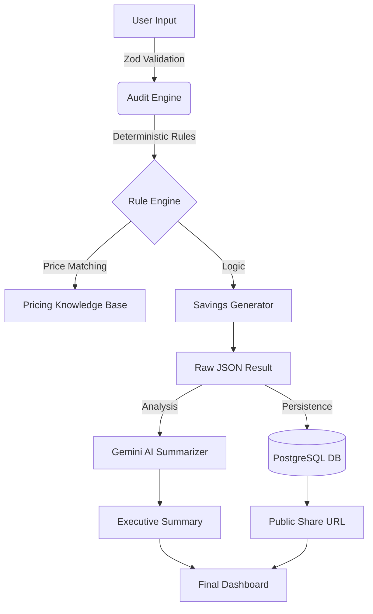

# Technical Architecture & Pipeline

Credex is built with a **Deterministic-First** philosophy. In a market saturated with "hallucinating" AI agents, we prioritize financial accuracy over probabilistic estimates. Our architecture ensures that every dollar found is defensible to a CFO.

## 🏗️ High-Level System Overview

## 🛠️ The Pipeline in Detail

### 1. Ingestion Layer
- **Form Component**: Built with `react-hook-form` and `zod`. We capture company size, industry, and a dynamic list of tools.
- **Persistence**: We use `sessionStorage` for immediate persistence (no account required) and **Prisma** for long-term database storage when a shareable link is generated.

### 2. The Deterministic Engine (`core/audit-engine`)
- **Knowledge Base**: A curated registry of 2026 pricing for the top 50 AI/SaaS tools.
- **Rule Sets**:
    - **Overlap Detection**: Identifying if a company pays for both Cursor and GitHub Copilot.
    - **Tier Optimization**: Detecting if a "Team" plan is cheaper than "Pro" for their headcount.
    - **Dormancy Logic**: Highlighting potential savings from reclaiming seats based on industry averages for active/inactive ratios.

### 3. The AI Intelligence Layer
- **Gemini 1.5 Flash**: Instead of letting AI do the "math" (where it often fails), we use it to synthesize the raw JSON savings into a "Human-readable letter."
- **Fallback Logic**: If the AI API is down, the system gracefully falls back to a deterministic template, ensuring zero downtime for the user.

### 4. Viral Distribution (OG Logic)
- **Dynamic Metadata**: Every audit generates a unique public slug. We use Next.js `generateMetadata` to populate Open Graph tags so that when a founder shares their audit on X/Twitter, the preview card shows their actual potential savings (e.g., *"Acme Corp could save $42k/yr"*).

## 🚀 Future Scalability

If we scale to 100k+ concurrent audits, our roadmap includes:
1. **Redis Caching**: To prevent hitting the Postgres database for every public URL view.
2. **Edge Runtimes**: Moving the audit engine to the Edge to minimize TTFB (Time to First Byte).
3. **Plaid Integration**: Automating the "Ingestion" step by reading real transaction data from bank feeds.
