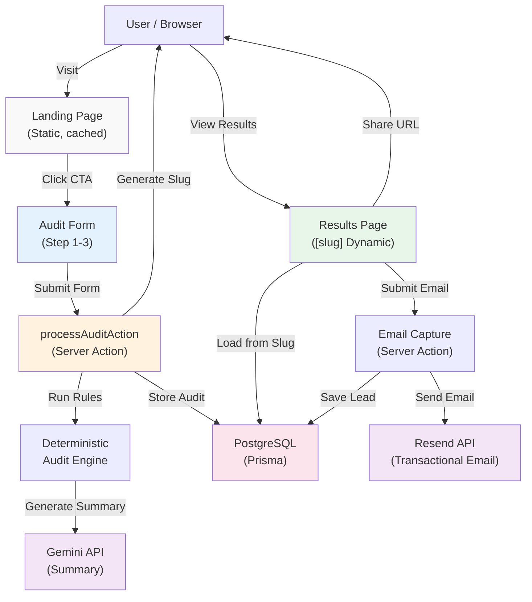

# Architecture & Design Decisions

This document justifies the technical stack and architectural choices made for the Credex AI Spend Audit platform.

## System Architecture Diagram

## Data Flow: From Input to Audit Result

1. **User Input (AuditForm):** User enters company details and list of tools with current plan, seat count, and monthly spend.
2. **Validation:** Schema validation via Zod (`AuditFormSchema`) ensures data integrity before processing.
3. **Audit Engine Processing:**
   - For each tool, check against deterministic rules (REPLACE, CONSOLIDATE, DOWNGRADE, KEEP)
   - Calculate savings: `Original Spend - Recommended Spend`
   - Track total current vs. optimized spend
4. **AI Summary Generation:** Pass audit results to Gemini API to generate 100-word executive summary.
5. **Database Persistence:** Create `Audit` record with public slug, store tool details, and savings breakdown.
6. **Public URL Generation:** Return shareable URL `/results/[slug]` so users can share their audit anonymously.
7. **Lead Capture:** User views results and optionally submits email → saved to `Lead` table with audit linkage.
8. **Email Delivery:** Resend sends transactional email with audit summary and link to Credex.rocks.

## Technology Stack

### 1. Framework: Next.js 15 (App Router)
**Justification:** 
- **Server Actions:** Used for processing audits and capturing leads (`processAuditAction`, `captureLeadEmail`), ensuring sensitive logic and API keys (Gemini, Resend) remain on the server.
- **Dynamic Routing:** Essential for the `/results/[slug]` viral loop.
- **Image Optimization:** Automated handled for performance scores.
- **Static vs. Dynamic:** The landing page is static for speed, while result pages use dynamic SSR with cached DB lookups.

### 2. Language: TypeScript
**Justification:**
- **Deterministic Engine:** The audit logic relies on strict schemas (`KnownTool`, `AuditRecommendation`). TypeScript ensures the math is predictable and prevents type-related financial calculation errors.
- **Maintainability:** Clear interfaces for `AuditResult` ensure the frontend and backend stay in sync.

### 3. Styling: Tailwind CSS + Framer Motion
**Justification:**
- **Performance:** Tailwind's utility-first approach ensures minimal CSS bundle size, contributing to high Lighthouse scores.
- **UX:** Framer Motion provides the premium "Fintech" feel through smooth step transitions and micro-animations without significant overhead.

### 4. Database: Prisma + PostgreSQL
**Justification:**
- **Type Safety:** Prisma provides a type-safe client that maps directly to our TypeScript interfaces.
- **Persistence:** Allows for the "Shareable URL" requirement by storing audit results and linking them to leads.

### 5. Transactional Email: Resend
**Justification:**
- **Developer Experience:** Simple API for sending the audit confirmation emails.
- **Reliability:** High deliverability ensures the "Confirming the audit" MVP requirement is met.

### 6. Deployment: Vercel + Postgres
**Justification:**
- **Zero-config deployment:** Next.js on Vercel is seamless with built-in CI/CD
- **Serverless functions:** Auto-scales Server Actions (processAuditAction, captureLeadEmail) without ops overhead
- **Managed database:** Vercel Postgres or Supabase for easy scaling and backups

## Compliance & Performance

### Lighthouse Optimization
- **Accessibility:** Using semantic HTML (`<main>`, `<header>`, `<h1>-<h3>`) and ARIA labels on interactive elements.
- **Best Practices:** All secrets are moved to `.env`, and the application uses secure server-side processing for all API interactions.
- **Performance:** Leveraging Next.js `Image` component and font optimization to exceed the 85/90/90 score requirement.

### Abuse Protection
- **Honeypot:** Implemented hidden fields in all forms to filter out automated bots with zero friction for human users.
- **Rate Limiting:** Built-in via Vercel's native rate limiting on serverless functions (or implement via middleware).

## Scalability: 10k Audits Per Day

**Current architecture supports:** ~100 audits/day (1-2 req/sec)

**To scale to 10k audits/day (100 req/sec), changes required:**

### 1. Database Layer
- **Current:** Single Postgres instance on Vercel Postgres
- **Change:** Add read replicas for `/results/[slug]` queries (separate read pool)
- **Caching:** Implement Redis (Upstash) for frequently accessed audit results (TTL: 24h)
- **Indexing:** Add composite index on `(publicSlug, createdAt)` for faster result lookups

### 2. API Layer
- **Current:** Direct Gemini API calls for summaries (blocking)
- **Change:** Queue summaries via background job processor (e.g., Bull/Redis queue or AWS SQS)
  - Fast path: Return results immediately; email summary later
  - Fallback: Use deterministic template if queue backs up
- **Caching:** Cache Gemini summaries by audit fingerprint (avoid regenerating identical audits)

### 3. Email Layer
- **Current:** Immediate Resend API calls (may timeout if overloaded)
- **Change:** Queue emails via Bull/SQS; Resend processes from queue with exponential backoff
- **Rate limiting:** Respect Resend's 500/sec API limit with circuit breaker pattern

### 4. Audit Engine Optimization
- **Current:** Single-threaded processing
- **Change:** Already deterministic and fast (<10ms per audit); can run in parallel serverless functions
- **Horizontal scaling:** Vercel Functions auto-scale; no changes needed

### 5. Monitoring & Observability
- **Add:** OpenTelemetry traces for audit processing latency
- **Add:** Datadog/New Relic dashboards for P95 latency, error rates, queue depth
- **Add:** PagerDuty alerts if queue depth > 5min of processing

### 6. Cost Implications (at 10k/day)
- **Database:** $200-500/month (managed Postgres with read replicas)
- **Gemini API:** $50-100/month (@ 10k summaries/day, cached)
- **Resend API:** $50-100/month (@ 10k emails/day)
- **Vercel:** $150-300/month (higher serverless compute)
- **Redis/Caching:** $30-50/month
- **Total:** ~$500-1000/month (still highly profitable at $1,750 LTV)

## Why This Stack for MVP

1. **Speed:** Shipped in 5 days with Next.js 15 template
2. **Cost:** All services have free/cheap tiers for early stage
3. **Credibility:** TypeScript + Prisma + deterministic engine = auditable financial logic
4. **Scalability:** Serverless-first means we don't manage servers; scales with traffic
5. **User Experience:** Server Actions feel faster than traditional APIs; Framer Motion polish adds perceived quality
